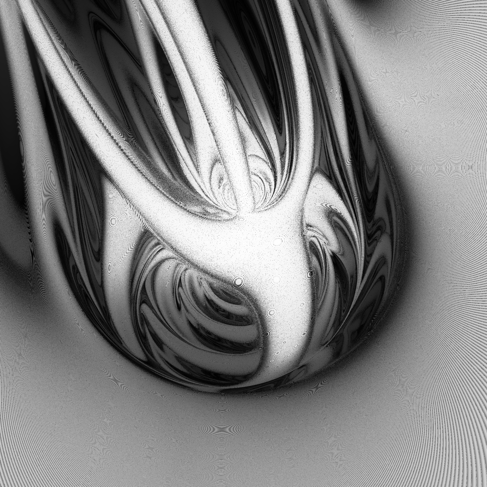
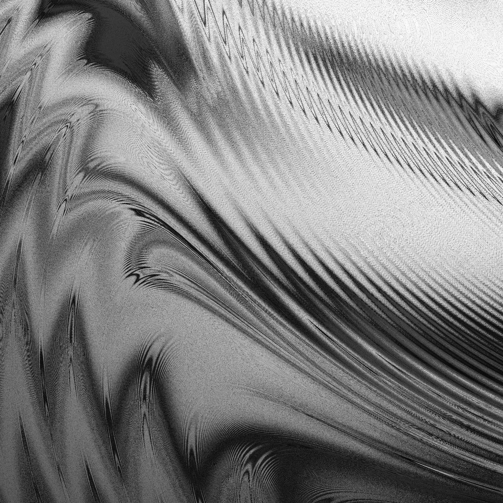
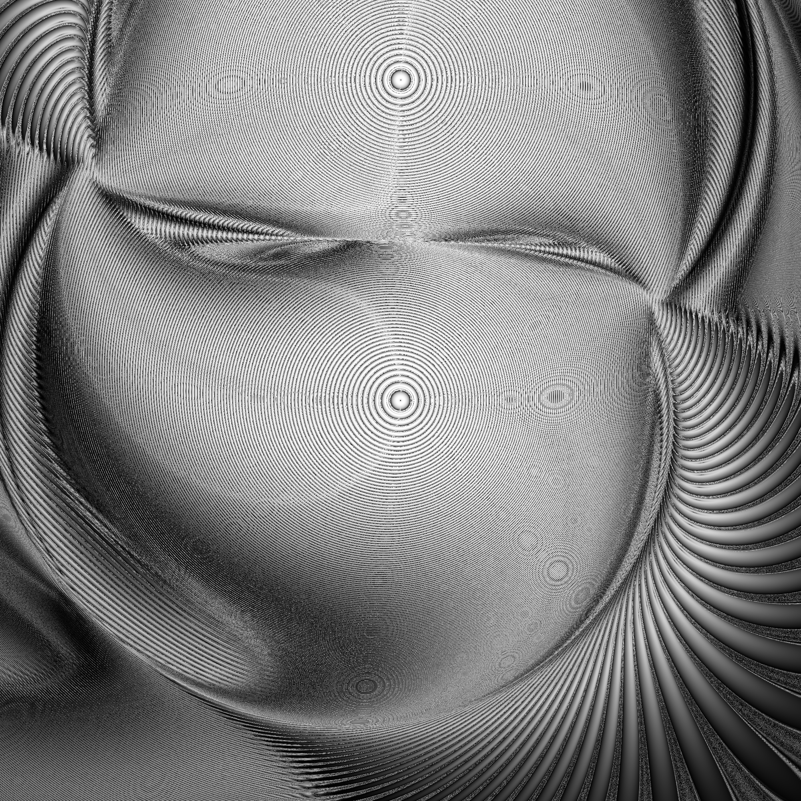

# ThreeBody
这是一个可以画一些神秘章鱼怪的小工具。  
这个简化的三体问题总共输入参数有12个，即为三个天体的x/y/vx/vy，根据平移对称性、旋转对称性，你可以固定其中五个不动，剩下还有七个参数，这就是个七维的参数空间。然后你可以取一些切面，把这个二维切面，对应的参数全部计算一遍，记录对应参数在失衡之前会存活多少帧，然后归一化，可视化，这样就得到了这些，在我面前扭动的大章鱼。
  由于大部分坐标点对应的参数最终都会失衡，而极少数的点会活到设置的计算帧数上限，分布极不均匀，所以它的归一化做了剔除前后百分之五的特殊处理。

我反复确认过，这些不是计算误差。欧拉法和rk4的计算有些区别，但差的并不是特别大，由此才敢抛砖引玉。计算误差存在，主要是网格采样和条纹干涉产生了一些摩尔纹，但主体结构是真实存在的。


上图参数：
```text
{'y2': 100.1, 'vx2': 0, 'vy2': 4.000000000000002, 'vx3': 1, 'vy3': 0, 'xmin': -500, 'ymin': -499, 'xmax': 499, 'ymax': 500, 'width': 2000, 'height': 2000, 'integrator': 'legacy', 'output': 'png', 'name': '40.png'}
```




如果加载失败可以直接点此项目中的png文件查看。

# three_body_sim2 调用说明

`three_body_sim2.c` 是新版 HTTP 引擎，默认监听：

```text
http://127.0.0.1:60002/
```

## 编译

```powershell
cd 'E:\codex专\TB参数空间'
gcc -O3 -fopenmp -std=c11 -Wall -Wextra -o three_body_engine2.exe three_body_sim2.c -lws2_32 -lm
```

如果不想用 OpenMP，也可以去掉 `-fopenmp`，只是会慢。

## 启动

```powershell
.\three_body_engine2.exe
```

健康检查：

```text
http://127.0.0.1:60002/health
```

## 参数

五个三体自由参数：

```text
y2    第二个天体的 y
vx2   第二个天体的 vx
vy2   第二个天体的 vy
vx3   第三个天体的 vx
vy3   第三个天体的 vy
```

渲染范围参数：

```text
xmin  左下角 x
ymin  左下角 y
xmax  右上角 x
ymax  右上角 y
```

图像大小：

```text
width
height
```

网格映射规则：

```text
x3 = xmin + col * (xmax - xmin) / (width - 1)
y3 = ymax - row * (ymax - ymin) / (height - 1)
```

积分器：

```text
integrator=legacy  旧版算法，和 three_body_sim.c 一致
integrator=rk4     四阶 Runge-Kutta，用于高精度对照
```

输出：

```text
output=png   输出 sim_output_percentile_inverted.png
output=data  输出 sim_result.txt 风格的文本数据
```

## 旧版等价参数

旧版参数：

```python
params = {
    "y2": 100.1,
    "vx2": 0,
    "vy2": 20,
    "vx3": 1,
    "vy3": 0,
}
```

在新版里要填成：

```python
params = {
    "y2": 100.1,
    "vx2": 0,
    "vy2": 20,
    "vx3": 1,
    "vy3": 0,
    "xmin": -500,
    "ymin": -499,
    "xmax": 499,
    "ymax": 500,
    "width": 1000,
    "height": 1000,
    "integrator": "legacy",
    "output": "png",
}
```

这组参数会复刻旧版网格：

```text
左上角:  x=-500, y=500
中心点:  x=0,    y=0
右下角:  x=499,  y=-499
```

## Python 保存 PNG 示例

```python
import requests

params = {
    "y2": 100.1,
    "vx2": 0,
    "vy2": 20,
    "vx3": 1,
    "vy3": 0,
    "xmin": -500,
    "ymin": -499,
    "xmax": 499,
    "ymax": 500,
    "width": 1000,
    "height": 1000,
    "integrator": "legacy",
    "output": "png",
}

response = requests.get("http://127.0.0.1:60002/", params=params, timeout=None)
response.raise_for_status()

with open("v2_100.1c0c20c1c0.png", "wb") as f:
    f.write(response.content)
```

## Python 保存数据示例

```python
import requests

params = {
    "y2": 100.1,
    "vx2": 0,
    "vy2": 20,
    "vx3": 1,
    "vy3": 0,
    "xmin": -500,
    "ymin": -499,
    "xmax": 499,
    "ymax": 500,
    "width": 1000,
    "height": 1000,
    "integrator": "legacy",
    "output": "data",
}

response = requests.get("http://127.0.0.1:60002/", params=params, timeout=None)
response.raise_for_status()

with open("v2_sim_result.txt", "w", encoding="utf-8") as f:
    f.write(response.text)
```

## 高精度对照示例

只需要把：

```python
"integrator": "legacy"
```

改成：

```python
"integrator": "rk4"
```

其余参数保持不变即可。


# three_body_sim
这是初代工具，大致逻辑和2相似但固定了很多东西。调用示范即为 计算.py，只有它对应的图像能被下面这个工具处理。

## trajectory_viewer.py调用

这是一个对已知图像进行更多互动操作的小工具，可以展示该像素对应那组参数的，实际天体轨迹。
调用命令：
python trajectory_viewer.py 100.1c0c5c1c0.png
它只能处理旧版本的数据格式。由于我的codex额度不足所以就暂时不能更新此项目了。

感谢codex对本项目的支持。免费额度又花光了。
